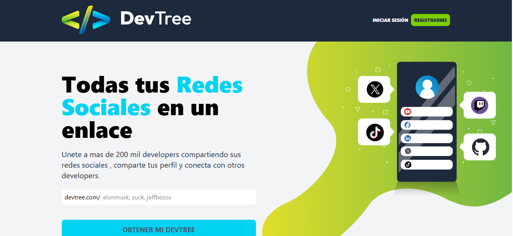
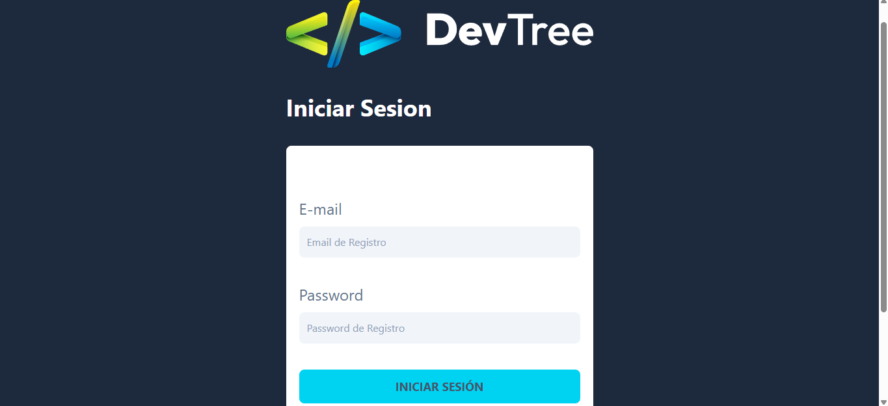
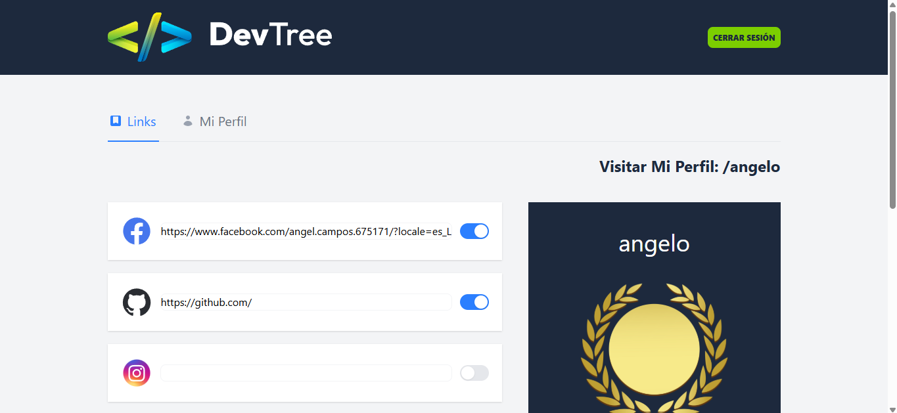
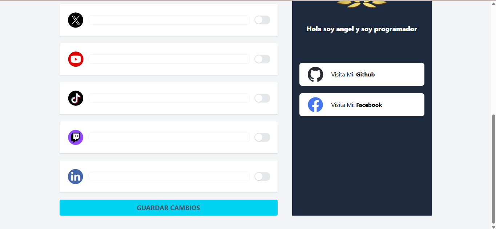
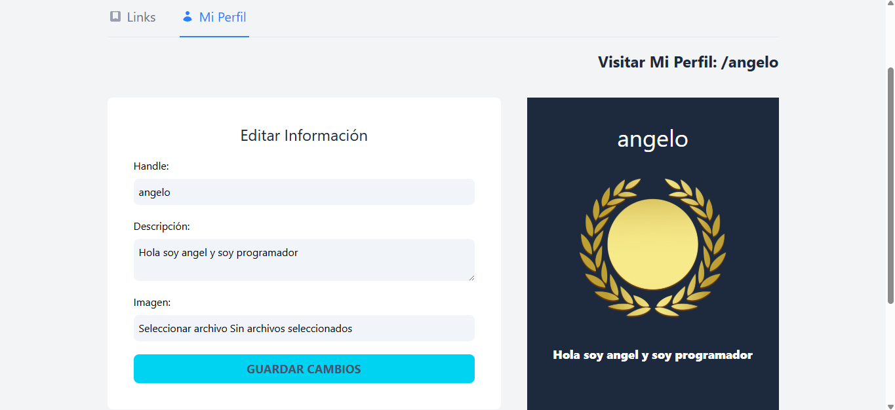

# 🌿 DevTree – Developer Profile Builder

DevTree is a full-stack web application that allows developers to build and share a customizable profile with links to their social media, portfolio, and contact information. It's fast, responsive, and easy to use.

> 🛠️ Built with the MERN stack and TypeScript.

---

## 🚀 Live Demo

👉 [Visit the site](https://angelcampos-devtree.netlify.app/)

---

## 📸 Preview

### 🖥️ Home View

### 🔗 Log in

### 🧑‍💻 Links Page

### 📱 Social Links

### ⚙️ Profile Page

---

## ✨ Features

- Drag & drop to reorder social links
- Custom profile card with name and bio
- Dynamic link icons and hover effects
- Backend with authentication and REST API
- Responsive UI built with Tailwind CSS

---

## 🧱 Tech Stack

**Frontend:**
- React
- TypeScript
- Vite
- Zustand (for global state)
- Tailwind CSS

**Backend:**
- Node.js
- Express
- TypeScript
- MongoDB
- Mongoose
- JWT (Authentication)

**Other:**
- Cloudinary (for image uploads)
- Render (backend deployment)
- Netlify (frontend deployment)

---

📄 License
This project is open source and available under the MIT License.

📬 Contact
Created by Angel Campos – feel free to reach out!
